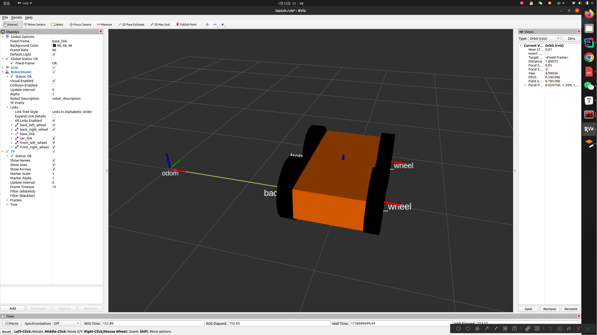
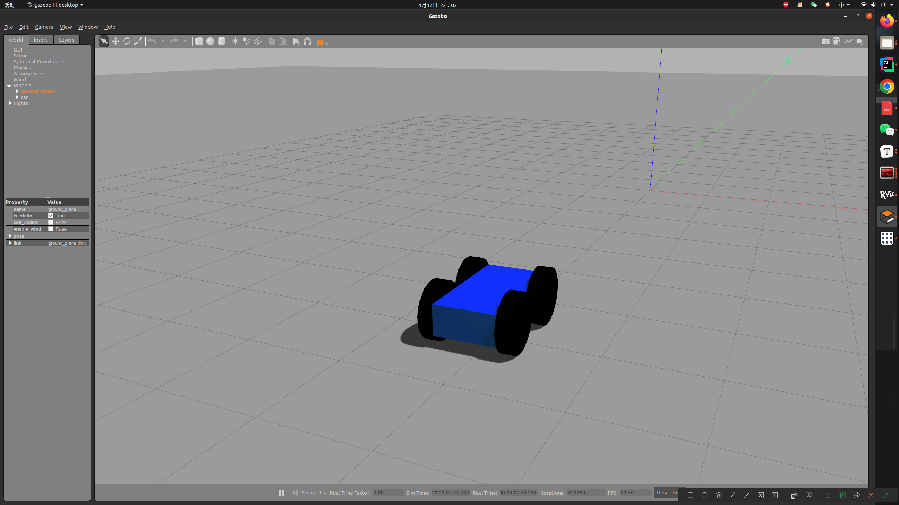
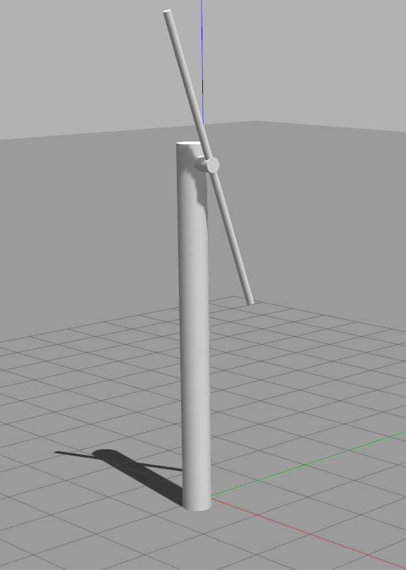
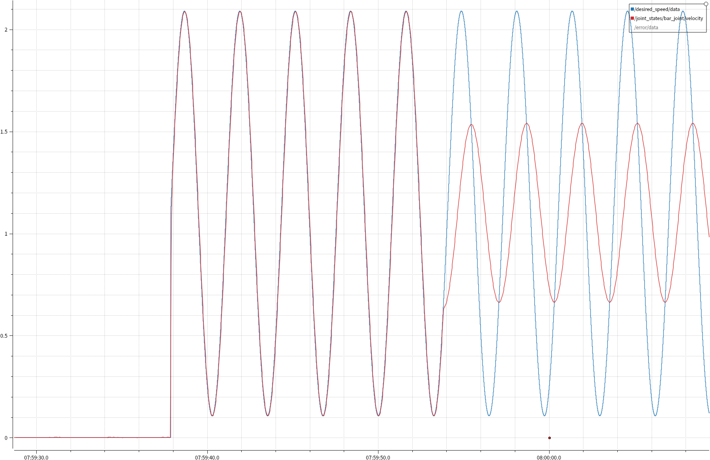
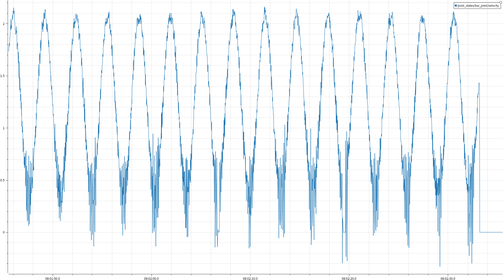

# 任务一览
> 笔记
> - 见 [Notes](./doc/notes.md)
## Learning_task 1
### 完成情况

控制器使用了ros官方的diff_drive_controller，见[差速控制器wiki](http://wiki.ros.org/diff_drive_controller)与[仓库](https://github.com/ros-controls/ros_controllers/tree/noetic-devel/diff_drive_controller)，[原理wiki](https://en.wikipedia.org/wiki/Differential_wheeled_robot#Kinematics_of_Differential_Drive_Robots)

根据wiki的yaml例子和自己的urdf小车参数写好yaml，并写好launch就可以用了，注意需要输入的/cmd_vel的命名空间（urdf需要导入gazebo_ros_control插件，[URDF_Design](./doc/URDF_Design.md)

## Learing_task 2
> 详见
> - [构建过程](./doc/前馈+PID.md)

### 编写风车urdf模型

### 前馈+PID控制输出图像

在仿真中：前面为使用前馈，后面为关闭前馈

### 订阅的话题消息含义

`command`：

- `command` == 0 ：停止转动
- `command` == 1 ：大符
- `command` == 2 ：小符

`feedforward_mode`: 取值0或1，是否使用前馈（为1时使用前馈）。为方便调试，没有使用在yaml中配置是否使用前馈的方法
